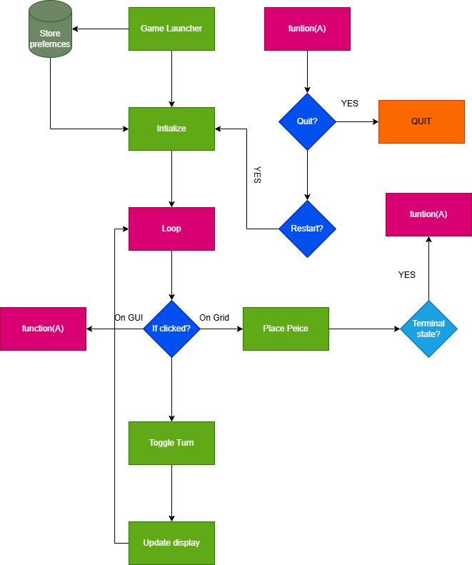
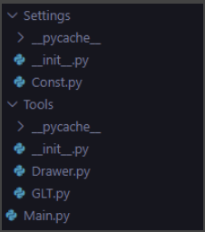
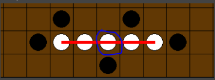

<h1 align="center" style="font-size: 64px;">
  GOMOKU GAME DOCUMENTATION
</h1>

# Table of Contents
- [Overview](#overview)
  - [What is Gomoku?](#what-is-gomoku)
  - [What are the rules of Gomoku?](#what-are-the-rules-of-gomoku)
- [PvP Gomoku Design](#pvp-gomoku-design)
  - [Top-level Design](#top-level-design)
  - [File Structure](#file-structure)
- [Detailed Design](#detailed-design)
  - [Game Launcher (Main.py)](#game-launcher-mainpy)
  - [Initialization code (Main.py)](#initialization-code-mainpy)
  - [Core Logic (Main.py)](#core-logic-mainpy)
  - [Drawing functions (Drawer.py)](#drawing-functions-drawerpy)
  - [Terminal Function (GLT.py)](#terminal-function-gltpy)

# Overview

## What is Gomoku?

Gomoku is a two-player board game played on a square grid where the goal is to align a fixed number of stones in a row. Players alternate turns, placing stones on empty cells, with the first player to achieve the required alignment winning the game.

## What are the rules of Gomoku?

### Players

- Gomoku is played by two players, usually referred to as Black and White.

### Board

- The game is played on a square grid board, most commonly 15×15 or 19×19, though other sizes are possible.

### Turns

- Players take turns placing one stone per turn on an empty intersection of the board.
- Black traditionally makes the first move.

### Stone Placement

- Stones are placed on empty cells only
- Once placed, stones cannot be moved or removed

### Winning Condition

- A player wins by forming an unbroken line of N stones (typically 5) in any of the following directions:
  - Horizontal
  - Vertical
  - Diagonal (both directions)

### Exact vs Minimum Condition

- In most modern versions, five or more stones in a row count as a win
- Some rule sets require exactly five, but this project allows configuration

### Draw Condition

- If the board is completely filled and no player has achieved the winning condition, the game ends in a draw.

# PvP Gomoku Design

## Top-level Design



*Fig 1,1 made on [draw.io](http://draw.io) by Umer Raza*

## File Structure



### Const.py

1. I created a separate file for all the constant variables to make it easier and clearer to work with

### Drawer.py

1. Made to Draw:
   1. GUI
   2. Board
   3. Peices
   4. Highlight Winner

### GLT.py

1. It consists only of a function checking the terminal state
2. Tells where to highlight
3. Indicates which player won

### Main.py

1. Handles main operations, run by the user
2. Configures and integrates the rest of the files

# Detailed Design

## Game Launcher (Main py)

I firstly acquired the following information from the User:

- Board size
- Winning condition

I used the tkinter library since it is easier and the best option for making a GUI. I also added a launch button from which you can start the game by clicking

### Code

```python
root = tk.Tk()
root.title("Gomoku Launcher")
root.geometry("200x250")

# --- Board size ---
tk.Label(root, text="Select Board Size:").pack(pady=10)
c.GAME_SIZE = tk.IntVar(value=15)
size_options = list(range(3, 21))
tk.OptionMenu(root, c.GAME_SIZE, *size_options).pack(pady=5)

# --- Win condition ---
tk.Label(root, text="Win Condition:").pack(pady=10)
c.WIN_CONDITION = tk.IntVar(value=5)

win_menu = tk.OptionMenu(root, c.WIN_CONDITION, *range(3, c.GAME_SIZE.get() + 1))
win_menu.pack(pady=5)

# --- update win options when board size changes ---
def update_win_options(*args):
    menu = win_menu["menu"]
    menu.delete(0, "end")

    for i in range(3, c.GAME_SIZE.get() + 1):
        menu.add_command(
            label=i,
            command=lambda v=i: c.WIN_CONDITION.set(v)
        )

    # keep win condition valid
    if c.WIN_CONDITION.get() > c.GAME_SIZE.get():
        c.WIN_CONDITION.set(c.GAME_SIZE.get())

c.GAME_SIZE.trace_add("write", update_win_options)

# --- launch ---
tk.Button(root, text="Launch", command=root.destroy).pack(pady=20)
root.mainloop()

print("Board size:", c.GAME_SIZE.get())
print("Win condition:", c.WIN_CONDITION.get())
c.GAME_SIZE = c.GAME_SIZE.get()
c.WIN_CONDITION = c.WIN_CONDITION.get()
c.BLOCK_SIZE = c.SCREEN_SIZE // c.GAME_SIZE
````

---

## Initialization code (Main py)

The following code is used to initialize. The program inside the function will be used to re-initialize after restart logic, and the rest will be run only 1 time

```python
# --- Initialization ---
pygame.init()
screen = pygame.display.set_mode((c.SCREEN_SIZE + c.GUI_SPACING, c.SCREEN_SIZE))
pygame.display.set_caption("Gomoku")
clock = pygame.time.Clock()

def init_board():
    global board, turn, grid_x, grid_y
    board = [[0 for _ in range(c.GAME_SIZE)] for _ in range(c.GAME_SIZE)]
    turn = random.choice([1, 2])
    grid_x, grid_y = 0, 0

# restart GUI function
def restart_gui(mx=-1, my=-1):
    if c.SCREEN_SIZE + 10 <= mx <= c.SCREEN_SIZE + c.GUI_SPACING - 10:
        if c.SCREEN_SIZE - 60 <= my <= c.SCREEN_SIZE - 10:
            # restart button
            init_board()
            return True
        if c.SCREEN_SIZE - 120 <= my <= c.SCREEN_SIZE - 70:
            # quit button
            pygame.quit()
            exit()
        return False
```

---

## Core Logic (Main py)

The main function, as described in the top-level design, is given below:

```python
# --- Main loop ---
init_board()
while True:
    # reset screen
    screen.fill((97, 56, 4))
    for event in pygame.event.get():
        # quit events
        if event.type == pygame.QUIT:
            pygame.quit()
            exit()

        if event.type == pygame.KEYDOWN:
            if event.key == pygame.K_ESCAPE:
                pygame.quit()
                exit()
            if event.key == pygame.K_SPACE:
                init_board()

        if event.type == pygame.MOUSEBUTTONDOWN:
            # get mouse position
            mouse_x, mouse_y = pygame.mouse.get_pos()
            grid_x = mouse_x // c.BLOCK_SIZE
            grid_y = mouse_y // c.BLOCK_SIZE
            print(f"Clicked on grid: ({grid_x}, {grid_y})")
            print(f"{c.GAME_SIZE=}, {c.SCREEN_SIZE=}, {c.BLOCK_SIZE=}")

            if (0 <= grid_x < c.GAME_SIZE and 0 <= grid_y < c.GAME_SIZE):
                # update board & turn
                if board[grid_y][grid_x] == 0:
                    board[grid_y][grid_x] = turn
                    turn = 2 if turn == 1 else 1

                    # check for win
                    result = glt.termial_state(board, grid_x, grid_y)
                    if result[0]:
                        print(f"Player {board[grid_y][grid_x]} wins!")
                        print("Winning coordinates:", result[1])
                        d.draw_board(screen, c.GAME_SIZE, board)
                        d.highlight_winner(screen, result[1])
                        d.draw_gui(screen, turn)

                        # restart logic
                        w = True
                        while w:
                            pygame.display.update()
                            for ev in pygame.event.get():
                                if ev.type == pygame.QUIT:
                                    pygame.quit()
                                    exit()
                                if ev.type == pygame.KEYDOWN:
                                    if ev.key == pygame.K_ESCAPE:
                                        pygame.quit()
                                        exit()
                                    if ev.key == pygame.K_SPACE:
                                        init_board()
                                        w = False
                                        break
                                if ev.type == pygame.MOUSEBUTTONDOWN:
                                    mx, my = pygame.mouse.get_pos()
                                    if restart_gui(mx, my):
                                        w = False
                                        break

            else:
                # check if click on the GUI area
                if restart_gui(mouse_x, mouse_y):
                    continue

    # draw board and pieces
    d.draw_board(screen, c.GAME_SIZE, board)
    d.draw_gui(screen, turn)
    pygame.display.update()
    clock.tick(60)
```

---

## Drawing functions (Drawer py)

### Drawing Pieces

```python
class Piece:
    def __init__(self, player, coord):
        self._player = player
        self._coord = coord

    def draw(self, screen):
        x, y = self._coord
        if self._player == 1:
            pygame.draw.circle(
                screen, (0, 0, 0),
                (x * c.BLOCK_SIZE + c.BLOCK_SIZE // 2,
                 y * c.BLOCK_SIZE + c.BLOCK_SIZE // 2),
                c.BLOCK_SIZE // 2 - 5
            )
        else:
            pygame.draw.circle(
                screen, (255, 255, 255),
                (x * c.BLOCK_SIZE + c.BLOCK_SIZE // 2,
                 y * c.BLOCK_SIZE + c.BLOCK_SIZE // 2),
                c.BLOCK_SIZE // 2 - 5
            )
            pygame.draw.circle(
                screen, (0, 0, 0),
                (x * c.BLOCK_SIZE + c.BLOCK_SIZE // 2,
                 y * c.BLOCK_SIZE + c.BLOCK_SIZE // 2),
                c.BLOCK_SIZE // 2 - 5, 1
            )
```

### Drawing Board

```python
def draw_board(screen, cells, board):
    block_size = c.SCREEN_SIZE // cells
    for x in range(0, c.SCREEN_SIZE + 1, block_size):
        pygame.draw.line(screen, (0, 0, 0), (x, 0), (x, c.SCREEN_SIZE), 1)
    for y in range(0, c.SCREEN_SIZE + 1, block_size):
        pygame.draw.line(screen, (0, 0, 0), (0, y), (c.SCREEN_SIZE, y), 1)

    # draw pieces
    for y in range(cells):
        for x in range(cells):
            if board[y][x] != 0:
                Piece(board[y][x], (x, y)).draw(screen)
```

### GUI Drawing

```python
def draw_gui(screen, turn, w=None):
    font = pygame.font.SysFont(None, 36)
    if w:
        text = font.render(f"Player {w} wins!", True, (255, 255, 255))
    else:
        text = font.render(f"Player {turn}'s turn", True, (255, 255, 255))

    screen.fill((50, 50, 50), (c.SCREEN_SIZE, 0, c.GUI_SPACING, c.SCREEN_SIZE))
    screen.blit(text, (c.SCREEN_SIZE + 10, 10))
    instructions = [
        "Press SPACE to restart",
        "Press ESC to quit"
    ]

    for i, instruction in enumerate(instructions):
        text = font.render(instruction, True, (255, 255, 255))
        screen.blit(text, (c.SCREEN_SIZE + 10, 40 + i * 30))

    # button
    pygame.draw.rect(
        screen, (200, 0, 0),
        (c.SCREEN_SIZE + 10, c.SCREEN_SIZE - 60, c.GUI_SPACING - 20, 50)
    )
    button_text = font.render("Restart", True, (255, 255, 255))
    screen.blit(
        button_text,
        (c.SCREEN_SIZE + (c.GUI_SPACING - 20) // 2 - button_text.get_width() // 2,
         c.SCREEN_SIZE - 60 + 15)
    )

    pygame.draw.rect(
        screen, (0, 0, 200),
        (c.SCREEN_SIZE + 10, c.SCREEN_SIZE - 120, c.GUI_SPACING - 20, 50)
    )
    quit_text = font.render("Quit", True, (255, 255, 255))
    screen.blit(
        quit_text,
        (c.SCREEN_SIZE + (c.GUI_SPACING - 20) // 2 - quit_text.get_width() // 2,
         c.SCREEN_SIZE - 120 + 15)
    )
```

### Highlighting Winner

```python
def highlight_winner(screen, win_coords):
    if win_coords is None:
        return

    x1, y1, x2, y2 = win_coords
    start_pos = (
        x1 * c.BLOCK_SIZE + c.BLOCK_SIZE // 2,
        y1 * c.BLOCK_SIZE + c.BLOCK_SIZE // 2
    )
    end_pos = (
        x2 * c.BLOCK_SIZE + c.BLOCK_SIZE // 2,
        y2 * c.BLOCK_SIZE + c.BLOCK_SIZE // 2
    )
    pygame.draw.line(screen, (255, 0, 0), start_pos, end_pos, 5)
```

---

## Terminal Function (GLT py)

### Optimization

At first,I thought of using [bitmasks](https://en.wikipedia.org/wiki/Mask_%28computing%29) to represent each board state in binary but when I calculated the complexity and came to the following analysis:
```
Let length of board = n
Cells = n*n
Number of bits representing a single cell = 2 (00 for P1, 01 for P2, 11 for empty)
Thus space complexity would have been O(2*n^2) = O(n^2)
And since we will checking each area through bit masks then,
Time Complexity would have been O(n^2)
```
However after some brainstorming, I came to realize that, since Gomoku is a turn-based game, and each player places only one stone per turn, it is unnecessary to scan the entire board to check for a win after every move.Insteas we can use the following method:

1. **Track the last move:** After a player places a stone, the game records its coordinates (x, y).
2. Check only relevant lines: The win condition is verified by counting consecutive stones only along the four possible directions from the last move:

   1. Horizontal (row)
   2. Vertical (column)
   3. Diagonal (top-left to bottom-right)
   4. Anti-diagonal (top-right to bottom-left)

4. **Stop early:** The counting stops as soon as either the number of consecutive stones reaches the win condition or an empty/other-player stone is encountered.

**Complexity analysis:**
Let win condition = m
Then, since we are checking 4 diagnals it becomes O(4m), which gives a linear time complexity of O(m)

**Example:**
Lets look at a small example on a 15x15 grid with 5 consecutive pieces making the winner.

****

The white piece circled blue is the last piece placed, for simplicity let it’s coordinate be (0,0) if we look at the next piece, it is also white so we increment our counter by 1 until it reaches a piece where it is not white, or counter is greater than 5 i.e the winning condition:
```
Let Board = b
Item = b(y,x)

1. Counter = 1, b(0,0)   #current peice also counts
2. Counter = 2, b(0,1)  #check right
3. Counter = 3, b(0,2) #check right
4. Counter = 3 , b(0,0) # the pointer is reset to the center since b(0,3) is not white
   But we still have to count to the left since it is a part of the row too
5. Counter = 4, b(0,-1) #check left
6. Counter = 5, b = (0,-2) #counter is equal to win contion thus we return True and draw a line from b(0,2) to b(0,-2)
```
### Code

```python
def termial_state(board, lx, ly):
    player = board[ly][lx]
    if player == 0:
        return [False, None]

    directions = [(1, 0), (0, 1), (1, 1), (1, -1)]

    for dx, dy in directions:
        count = 1
        bx, by = lx, ly
        nx, ny = lx, ly

        for step in range(1, c.WIN_CONDITION):
            tx, ty = lx + step * dx, ly + step * dy
            print(f"Checking ({tx}, {ty}) in direction ({dx}, {dy})")
            if not (0 <= tx < c.GAME_SIZE and 0 <= ty < c.GAME_SIZE):
                break
            else:
                if board[ty][tx] == player:
                    count += 1
                    nx, ny = tx, ty
                else:
                    break

        for step in range(1, c.WIN_CONDITION):
            tx, ty = lx - step * dx, ly - step * dy
            print(f"Checking ({tx}, {ty}) in direction (-{dx}, -{dy})")
            if not (0 <= tx < c.GAME_SIZE and 0 <= ty < c.GAME_SIZE):
                break
            else:
                if board[ty][tx] == player:
                    count += 1
                    bx, by = tx, ty
                else:
                    break

        if count >= c.WIN_CONDITION:
            return [True, (bx, by, nx, ny)]

    return [False, None]
```